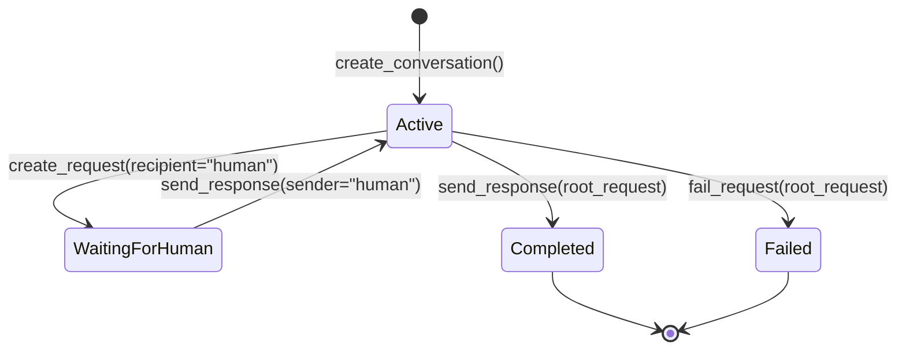
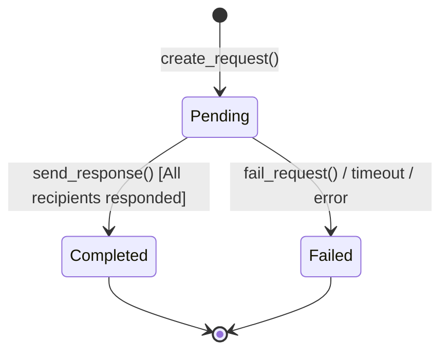
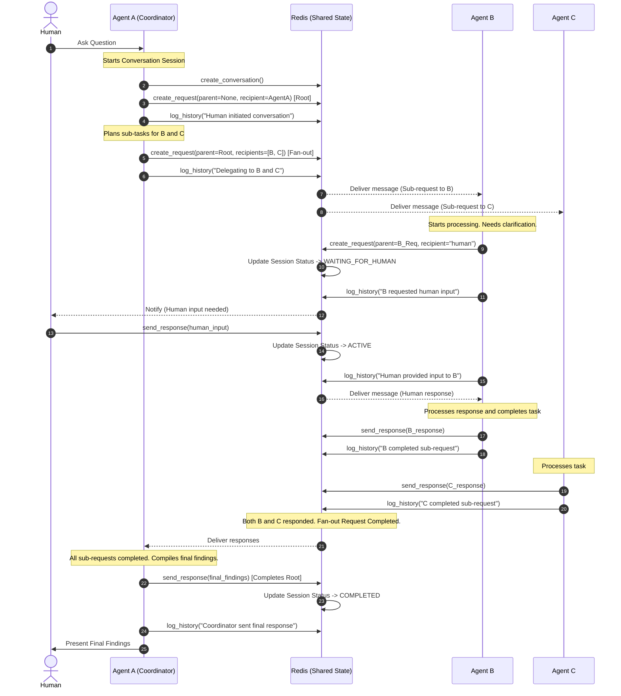

# Neurogossip v3 - High-Level Design

This document describes the design of **neurogossip-agent-v3**, a conversational session management protocol and client library for AI agents. 

Neurogossip v3 enables agents to maintain multi-turn, multi-agent conversations, trace sub-request delegation trees, log full conversation histories, and cleanly integrate human-in-the-loop approvals.

---

## 1. System Architecture

The system uses **Redis** as a shared, durable state store to manage the state of conversations, requests, responses, and chronological logs. Messaging between agents is transport-agnostic; the default implementation uses `neurogossip-client-v2` (Redis Streams + Pub/Sub).

```
                      ┌──────────────────────────────────────────────┐
                      │                 Redis Store                  │
                      │                                              │
                      │  ┌────────────────────────────────────────┐  │
                      │  │  Session State                         │  │
                      │  │  conversation_id → metadata, status    │  │
                      │  └────────────────────────────────────────┘  │
                      │  ┌────────────────────────────────────────┐  │
                      │  │  Request Trees                         │  │
                      │  │  request_id → status, parent, payload  │  │
                      │  └────────────────────────────────────────┘  │
                      │  ┌────────────────────────────────────────┐  │
                      │  │  Persistent History Logs               │  │
                      │  │  conversation_id → [chronological events]│  │
                      │  └────────────────────────────────────────┘  │
                      └──────────────────────┬───────────────────────┘
                                             │
                                   State Query & Updates
                                             │
                      ┌──────────────────────▼───────────────────────┐
                      │        neurogossip-agent-v3 Client           │
                      │            (Session Manager)                 │
                      └──────────────────────┬───────────────────────┘
                                             │
                                   Transport Interface
                                             │
                      ┌──────────────────────▼───────────────────────┐
                      │              Transport Layer                 │
                      │     (Default: neurogossip-client-v2)         │
                      └──────────────────────────────────────────────┘
```

---

## 2. State Machines

### 2.1 Conversation Session Status

A conversation session transitions through states depending on the activity of the agents and whether human interaction is required.



### 2.2 Agent Request Status

Requests can target one agent, multiple agents (fan-out), or a human. A fan-out request transitions from `Pending` to `Completed` only after **all** target recipients have responded.



---

## 3. Sequence Diagram

The following sequence diagram demonstrates a multi-agent delegation flow where **Agent A** (the coordinator) receives a human query, delegates tasks to **Agent B** and **Agent C** via a fan-out request, and **Agent B** requires human input mid-execution.


